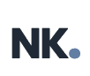

<p align="center">
  
</p>

<h1 align="center">Nur Kumbasar — Personal Portfolio</h1>

<p align="center">
  <strong>🚀 nurkumbasar.com</strong><br/>
  Bilgisayar Mühendisliği öğrencisi & QA Intern — kişisel portföy web sitesi.
</p>

<p align="center">
  <a href="https://nurkumbasar.com">🌐 Canlı Site</a> •
  <a href="https://github.com/nurkumbasar">GitHub</a> •
  <a href="https://www.linkedin.com/in/nur-kumbasar">LinkedIn</a>
</p>

---

## 📸 Önizleme

<p align="center">
  
</p>

---

## ✨ Özellikler

| Özellik | Açıklama |
|---------|----------|
| 🎨 **IDE Temalı Tasarım** | VS Code / terminal estetiğinden ilham alan modern arayüz |
| 🌙 **Dark / Light Mode** | Tema geçişi desteği |
| 🌍 **Çift Dil (TR / EN)** | Türkçe ve İngilizce arasında geçiş |
| 💻 **İnteraktif Terminal** | Gerçek komutları destekleyen terminal emülatörü |
| 🦖 **Gizli Dino Oyunu** | Terminale `hack` yazarak erişilen easter egg |
| 📱 **Responsive Tasarım** | Mobil, tablet ve masaüstüne uyumlu |
| 🎯 **Aurora Arka Plan** | Dinamik blob animasyonları |
| 📄 **CV İndirme** | Tek tıkla PDF CV indirme |

---

## 🛠️ Teknolojiler

```
HTML5 · CSS3 · Vanilla JavaScript
```

- **Font**: [Geist Mono](https://fonts.google.com/specimen/Geist+Mono)
- **İkonlar**: [Font Awesome 6.5](https://fontawesome.com/)
- **Hosting**: GitHub Pages + Custom Domain (CNAME)

---

## 📂 Proje Yapısı

```
nur-portfolio/
├── index.html          # Ana sayfa (tüm bölümler)
├── style.css           # Tüm stiller (63KB)
├── script.js           # Etkileşimler, terminal, tema, dil
├── Avatar_Nur.png      # Profil fotoğrafı
├── Nur_Kumbasar_CV.pdf # İndirilebilir CV
├── nk-favicon.png      # Favicon
├── image.png           # Site önizleme görseli (OG Image)
├── ramdesign.png       # RAM Design proje görseli
├── CNAME               # GitHub Pages custom domain
└── .gitignore
```

---

## 📑 Bölümler

1. **Hero** — Avatar, rozet animasyonları ve proje dropdown
2. **Hakkımda** — İnteraktif terminal + bio
3. **Deneyim** — Timeline formatında staj geçmişi
4. **Eğitim** — Akademik geçmiş
5. **Yetenekler** — Kategorize edilmiş skill kartları
6. **Projeler** — Tab yapısında proje detayları (GreenGrocer, RAM Design, DSA)
7. **İletişim** — İletişim formu ve sosyal linkler

---

## 🚀 Kurulum & Çalıştırma

Proje herhangi bir build aracı gerektirmez. Basit bir static site'tır.

```bash
# Repoyu klonlayın
git clone https://github.com/nurkumbasar/nur-portfolio.git
cd nur-portfolio

# Herhangi bir local server ile açın
# Örnek 1: Python
python3 -m http.server 8000

# Örnek 2: VS Code Live Server eklentisi
# index.html → sağ tık → "Open with Live Server"
```

Tarayıcınızda `http://localhost:8000` adresine gidin.

---

## 🌐 Deployment

Site **GitHub Pages** üzerinde barındırılmaktadır ve `nurkumbasar.com` custom domain'e yönlendirilmiştir.

```
CNAME → nurkumbasar.com
```

---

## 🤝 İletişim

- **Email**: nurkumbsr@gmail.com
- **LinkedIn**: [linkedin.com/in/nur-kumbasar](https://www.linkedin.com/in/nur-kumbasar)
- **GitHub**: [github.com/nurkumbasar](https://github.com/nurkumbasar)

---

<p align="center">
  <sub>Made with 💜 by Nur Kumbasar</sub>
</p>
