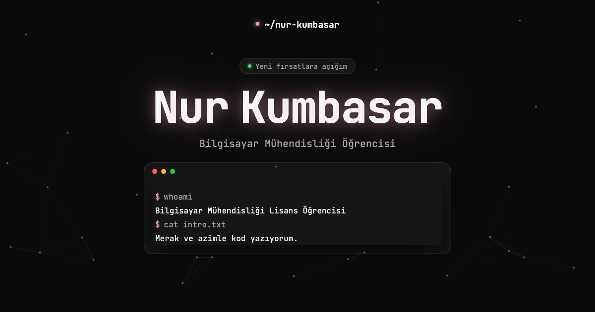

<h1 align="center">Nur Kumbasar — Kişisel Portfolyo</h1>

<p align="center">
  Bilgisayar Mühendisliği öğrencisinin kişisel portfolyo sitesi.<br/>
  <a href="https://nurkumbasar.com">nurkumbasar.com</a> •
  <a href="https://github.com/nurkumbasar">GitHub</a> •
  <a href="https://www.linkedin.com/in/nur-kumbasar">LinkedIn</a>
</p>

<p align="center">
  
</p>

---

## Özellikler

- **Terminal temalı arayüz:** Hero bölümünde karakter karakter "yazılan" terminal, cam efektli kartlar, fareye duyarlı parçacık arka planı ve aurora animasyonu.
- **Açık / koyu tema:** Sistem tercihini izler, navbar'dan elle değiştirilebilir ve hatırlanır.
- **Türkçe / İngilizce:** Tek tıkla dil değişimi; seçim hatırlanır, `<html lang>` güncellenir.
- **Nuriş maskotu:** Sayfada sürüklenebilen bir maskot. Tıklayınca Nur hakkındaki sorulara cevap veren, LLM destekli bir sohbet paneli açar.
- **Bölümler:** Hizmetler, Yolculuk (deneyim + eğitim), Yetenekler, Projeler, Diller, İletişim formu.
- **Erişilebilirlik:** `prefers-reduced-motion` desteği, ekran okuyucu için düz metin karşılıkları, `aria-live` form bildirimleri.

## Teknolojiler

React 19 · TypeScript · Vite · Vitest + Testing Library · oxlint  
Sunucu tarafı: Vercel serverless fonksiyonu (`api/chat.ts`) → Groq API  
İletişim formu: Formspree

## Mimari

Kod, **katmanlı (clean) mimariyle** düzenlenmiştir. Kural: *değişme sebebi farklı olan şeyleri ayır.*

```
src/
├── domain/          # Saf tipler (entities) ve sözleşmeler (ports). Hiçbir şeye bağımlı değil.
├── application/     # Kullanım senaryoları ve React state'i (context, hook'lar). Sadece domain'i bilir.
├── infrastructure/  # Dış dünya: içerik verisi, localStorage, Formspree, sohbet API'si. Portları gerçekler.
├── presentation/    # Bileşenler, stiller, i18n metinleri. Sadece application + domain'i bilir.
└── main.tsx         # Composition root: somut implementasyonlar burada seçilip enjekte edilir.
```

Bağımlılık yönü:

```
presentation ──▶ application ──▶ domain ◀── infrastructure
```

Örnek: bileşenler içeriği `ContentRepository` arayüzünden (`useContent()`), sohbeti `ChatService`
arayüzünden (`useMascotChat`) alır. İçerik bir dosyadan mı, CMS'ten mi geliyor; sohbet Groq'tan mı,
başka bir modelden mi cevap alıyor — bunu yalnızca `infrastructure` ve `main.tsx` bilir.

Bu kurallar `src/test/architecture.test.ts` ile **otomatik denetlenir**: yanlış yönde bir import
eklendiğinde test kırılır. Ayrıca `fetch`/`localStorage` çağrıları yalnızca `infrastructure` içinde olabilir.

Her katmanın kendi `README.md` dosyası var.

## Proje yapısı

```
.
├── api/chat.ts              # Vercel sunucu fonksiyonu: Groq'a güvenli istek (API anahtarı sadece burada)
├── src/                     # Site kodu (yukarıdaki katmanlar)
│   ├── test/                # Mimari testi, API testi, test için sahte bağımlılıklar
│   └── learn/               # Öğrenme alıştırmaları (site koduna dahil değil)
├── public/                  # Statik dosyalar (CV, favicon, paylaşım görseli)
├── legacy/                  # Sitenin eski (framework'süz) sürümü — arşiv
└── scratch/generate_cv.py   # CV PDF'ini üreten yardımcı betik
```

## Çalıştırma

```bash
npm install
npm run dev        # http://localhost:5173
npm test           # testleri izleme modunda çalıştır  (tek seferlik: npm test -- --run)
npm run lint       # oxlint
npm run build      # tip kontrolü + production build
```

> `npm run dev` yalnızca arayüzü çalıştırır; `/api/chat` (maskot sohbeti) yerelde
> Vercel ortamı gerektirir (`npx vercel dev`).

## Ortam değişkenleri

| Değişken | Nerede | Açıklama |
|---|---|---|
| `GROQ_API_KEY` | Vercel → Project Settings → Environment Variables | Maskot sohbeti için Groq API anahtarı. Yalnızca sunucu fonksiyonunda okunur, tarayıcıya gitmez. |

## Otomatik kontroller

Her `push` ve pull request'te GitHub Actions (`.github/workflows/ci.yml`) lint, test ve build adımlarını çalıştırır.

## Yayın

Site Vercel'de barındırılır ve `nurkumbasar.com` alan adına bağlıdır. `main` dalına yapılan her push yeni bir yayın üretir.

## İletişim

- **E-posta:** nurkumbsr@gmail.com
- **LinkedIn:** [linkedin.com/in/nur-kumbasar](https://www.linkedin.com/in/nur-kumbasar)
- **GitHub:** [github.com/nurkumbasar](https://github.com/nurkumbasar)
